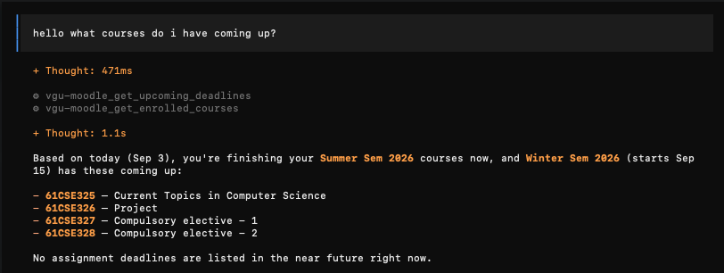
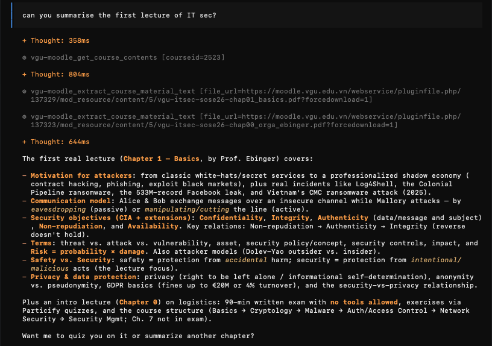
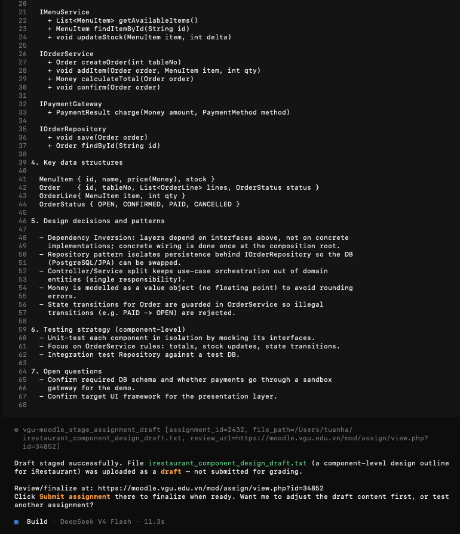

# VGU MCP

[](https://go.dev)
[](https://modelcontextprotocol.io)
[](LICENSE)
[](https://github.com/haanhtuandev/vgu-mcp/releases)
[](https://github.com/haanhtuandev/vgu-mcp/stargazers)

> **Your AI assistant, connected to VGU Moodle.**
> Ask it about deadlines, read lecture PDFs, check grades, stage assignment files —
> all without opening a browser.

> **Found it helpful? Give it a ★** on [GitHub](https://github.com/haanhtuandev/vgu-mcp) —
> it helps other VGU students discover it.

---

## See it in action

Ask about your courses, deadlines and grades in plain English:

<p align="center">
  
</p>

Or ask it to summarise a lecture PDF straight from Moodle:

<p align="center">
  
</p>

Even have it write an assignment and stage it as a draft for your review before submitting:

<p align="center">
  
</p>

---

## What you can do

- Ask about upcoming deadlines and grades in plain English
- Browse and download course materials
- Read PDF lecture notes — extracted and summarised instantly, no extra tools needed
- Stage assignment files as drafts on Moodle for your review before submitting

---

## Get started in 3 steps

**1. Install** the binary with one command:

<details>
<summary><strong>macOS & Linux</strong></summary>

```bash
curl -fsSL https://raw.githubusercontent.com/haanhtuandev/vgu-mcp/main/scripts/install.sh | sh
```

Installs to `~/.local/bin` (no sudo needed), verifies the checksum, and adds it to your `PATH`.
Prefer a manual download? Grab the `tar.gz` for your platform from [Releases →](https://github.com/haanhtuandev/vgu-mcp/releases) and put `vgu-mcp` on your `PATH`.
</details>

<details>
<summary><strong>Windows</strong></summary>

```powershell
irm https://raw.githubusercontent.com/haanhtuandev/vgu-mcp/main/scripts/install.ps1 | iex
```

Installs `vgu-mcp.exe` to `%LOCALAPPDATA%\Programs\vgu-mcp` and adds it to your user `PATH`.
Or just download the `.zip` from [Releases →](https://github.com/haanhtuandev/vgu-mcp/releases) and unzip it.
</details>

**2. Authenticate** once with your VGU credentials:
```bash
vgu-mcp setup
```
Your password is never saved — only a web service token is stored locally.

**3. Connect** to your AI client:

<details>
<summary><strong>OpenCode</strong></summary>

Add to `~/.config/opencode/opencode.json`:
```json
{
  "$schema": "https://opencode.ai/config.json",
  "mcp": {
    "vgu-moodle": { "type": "local", "command": ["vgu-mcp"] }
  }
}
```
</details>

<details>
<summary><strong>Claude Desktop</strong></summary>

Add to `~/Library/Application Support/Claude/claude_desktop_config.json` (macOS) or
`%APPDATA%\Claude\claude_desktop_config.json` (Windows):
```json
{
  "mcpServers": {
    "vgu-moodle": { "command": "vgu-mcp" }
  }
}
```
</details>

<details>
<summary><strong>Codex</strong></summary>

Add to `~/.codex/config.toml`:
```toml
[mcp_servers.vgu-moodle]
command = "vgu-mcp"
```
</details>

<details>
<summary><strong>Antigravity CLI</strong></summary>

Add to `~/.gemini/config/mcp_config.json` (global) or `.agents/mcp_config.json` (per project):
```json
{
  "mcpServers": {
    "vgu-moodle": { "command": "vgu-mcp" }
  }
}
```

Or run `/mcp` inside the Antigravity CLI to add it interactively.
</details>

<details>
<summary><strong>Cursor / other MCP clients</strong></summary>

Set the command to `vgu-mcp`. No arguments or environment variables required.
</details>

→ See the [Getting Started guide](docs/getting-started.md) for full setup instructions and troubleshooting.

---

## Try these prompts

Once connected, just type naturally in your AI chat:

- *"What assignments do I have due this week?"*
- *"Summarise the week 3 OS lecture slides for me"*
- *"Show me my grades for Distributed Systems"*
- *"Stage my lab2.zip to the component design assignment as a draft"*
- *"Quiz me on the Lab 2 specification PDF"*

---

## Docs

| | |
|---|---|
| [Getting Started](docs/getting-started.md) | Download, setup, AI client configuration |
| [Tool Reference](docs/tools.md) | All tools, parameters, and example prompts |
| [Configuration](docs/configuration.md) | Config file, environment variables, re-authentication |
| [Contributing](docs/contributing.md) | Project structure, adding tools, building from source |

---

MIT License — made by VGU students, for VGU students.
